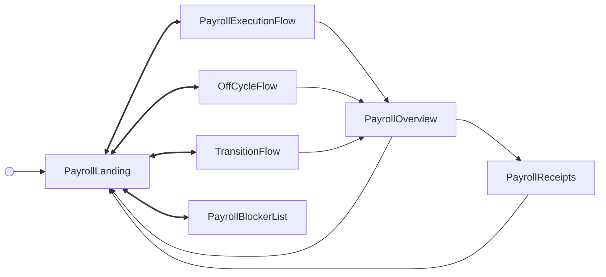

<!-- Partner-facing guide content, published to the SDK docs site. -->

# PayrollFlow

## Step flow <!-- slot: appendix -->

`PayrollFlow` opens on the landing page (`PayrollLanding`), which lists pending and calculated payrolls and acts as the hub: every path launches from it and returns to it, so the flow has no terminal step. Selecting a payroll to run (`runPayroll/selected`) or reviewing a calculated one (`payroll/review`) hands off to `PayrollExecutionFlow`; starting an off-cycle payroll (`runPayroll/offCycle/start`) or a pending transition payroll (`transition/runPayroll`) hands off to `OffCycleFlow` or `TransitionFlow`; and viewing all blockers (`runPayroll/blockers/viewAll`) opens `PayrollBlockerList`.

When any run path finishes processing (`runPayroll/processed`), the flow lands on the submitted overview (`PayrollOverview`), which can drill into receipts (`runPayroll/receipt/get` → `PayrollReceipts`). Returning to the landing hub happens via the breadcrumb header (`breadcrumb/navigate`) or **Save & exit** (`payroll/saveAndExit`) — here both are handled internally, returning to landing rather than exiting. A submitted payroll that is later cancelled (`runPayroll/cancelled`) also returns to landing, where a cancellation alert is shown.
