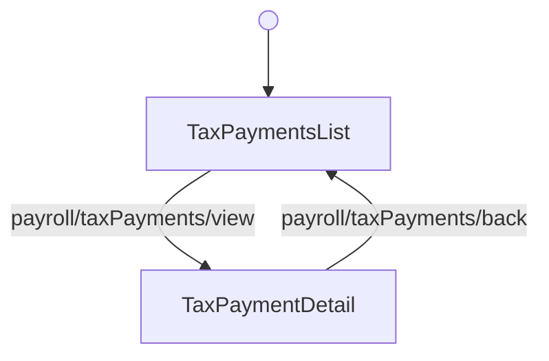

<!-- Partner-facing guide content, published to the SDK docs site. -->

# TaxPaymentsFlow

## Step flow <!-- slot: appendix -->

`TaxPaymentsFlow` centers on `TaxPaymentsList` as its hub. Selecting a payment (`payroll/taxPayments/view`) opens `TaxPaymentDetail`, and the back button (`payroll/taxPayments/back`) returns to the list.

The flow has no terminal step. Unmount it when you no longer need it.
