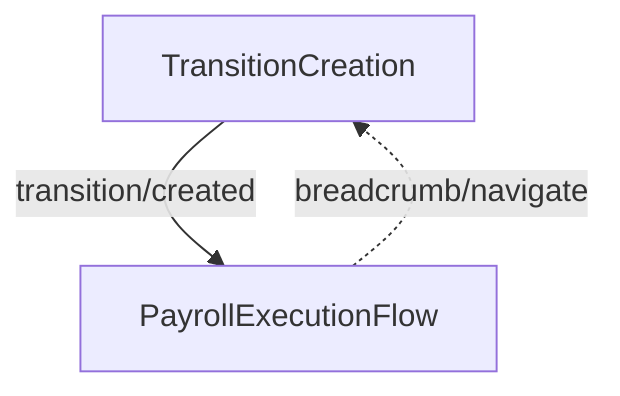

<!-- Partner-facing guide content, published to the SDK docs site. -->

# TransitionFlow

## Step flow <!-- slot: appendix -->

A transition payroll covers the workdays that fall between the end of an old pay schedule and the start of a new one, so employees are paid for the gap. The flow's entry point depends on whether `payrollUuid` is supplied. Without it, the flow opens on the creation step and advances into execution, as shown below. With it, the creation step is skipped and the flow starts directly in `PayrollExecutionFlow`.

## Creation step <!-- slot: appendix -->

The creation step shows the transition pay period (`startDate`–`endDate`) and the associated pay schedule name as read-only context, then collects:

- **Check date** — when employees are paid. For ACH processing this must be at least 2 business days out.
- **Deductions and contributions** — include or skip regular deductions. Defaults to including deductions.
- **Tax withholding rates** — withholding pay period frequency and rate type (regular or supplemental). Defaults to the regular rate with an every-other-week frequency.

On submission the step creates an off-cycle payroll with the `"Transition from old pay schedule"` reason and advances to execution with `transition/created`.

Transition pay periods should be resolved — run or skipped — before regular payrolls are run. The Gusto API may reject regular payrolls while unresolved transition periods exist.
