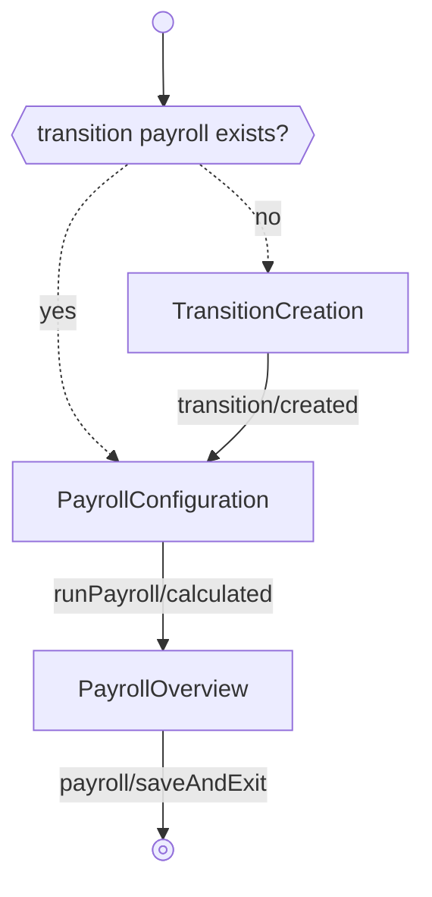

<!-- Partner-facing guide content, published to the SDK docs site. -->

# TransitionFlow

## Step flow <!-- slot: appendix -->

A transition payroll covers the workdays that fall between the end of an old pay schedule and the start of a new one, so employees are paid for the gap. Supply the pay period (`startDate`, `endDate`, `payScheduleUuid`); the flow resolves whether an unprocessed transition payroll already exists for it. If one exists, the flow opens directly on configuration; otherwise it opens on the creation step and advances to configuration once the payroll is created. From configuration it continues into the standard review, submit, and receipts steps.

```mermaid
flowchart
  start@{ shape: sm-circ } --> resolve{{"transition payroll exists?"}}
  resolve -.->|"no"| CreateTransitionPayroll["TransitionCreation"]
  resolve -.->|"yes"| Configuration["PayrollConfiguration"]
  CreateTransitionPayroll -->|"transition/created"| Configuration
  Configuration -->|"runPayroll/calculated"| Overview["PayrollOverview"]
  Overview -->|"payroll/saveAndExit"| done@{ shape: fr-circ, label: " " }
  class resolve branch
  class Configuration flow
  class Overview flow
```

The resolve/resume decision lives in `TransitionPayroll`, which you can also render on its own. Selecting **Save & exit** during execution emits `payroll/saveAndExit`, which the flow does not handle internally — it surfaces on `onEvent` to signal that the flow has been exited.

## Creation step <!-- slot: appendix -->

The creation step shows the transition pay period (`startDate`–`endDate`) and the associated pay schedule name as read-only context, then collects:

- **Check date** — when employees are paid. For ACH processing this must be at least 2 business days out.
- **Deductions and contributions** — include or skip regular deductions. Defaults to including deductions.
- **Tax withholding rates** — withholding pay period frequency and rate type (regular or supplemental). Defaults to the regular rate with an every-other-week frequency.

On submission the step creates an off-cycle payroll with the `"Transition from old pay schedule"` reason and advances to execution with `transition/created`.

Transition pay periods should be resolved — run or skipped — before regular payrolls are run. The Gusto API may reject regular payrolls while unresolved transition periods exist.
