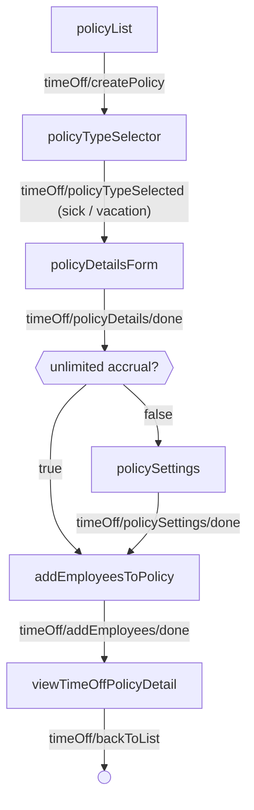
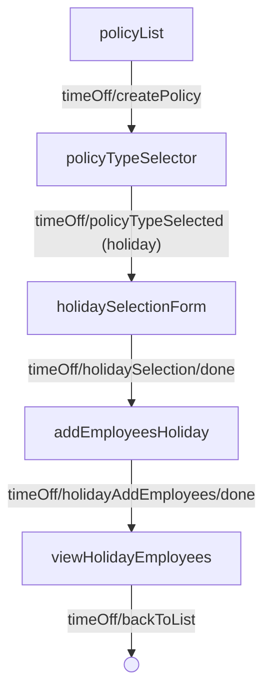
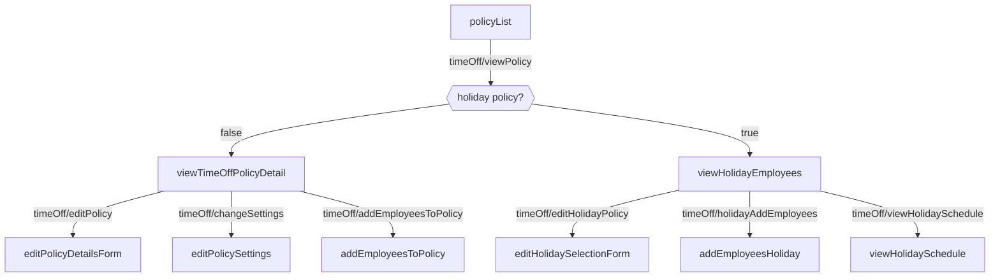

<!-- Partner-facing guide content, published to the SDK docs site. -->

# TimeOffFlow

## Step flow <!-- slot: appendix -->

The flow opens on the policy list. Creating a policy branches by the selected
policy type: sick and vacation share one path; holiday follows a separate one.
Each branch is shown on its own. Existing policies are opened from the list for
viewing, editing, and managing enrollment.

### Create a sick or vacation policy

Policies with an unlimited accrual method skip the settings step, since there is
no balance to cap or carry over.

### Create a holiday policy

Only one holiday policy can exist per company; the policy-type selector disables
the holiday option once one is configured.

### Open an existing policy

Selecting a policy from the list routes to the matching detail view by type.

## Policy types

| Type     | Description                                                   | API family           |
| -------- | ------------------------------------------------------------- | -------------------- |
| Sick     | Sick leave policy with configurable accrual and balance rules | Time Off Policies    |
| Vacation | Vacation policy with configurable accrual and balance rules   | Time Off Policies    |
| Holiday  | Paid holiday policy based on US federal holidays              | Holiday Pay Policies |

## Accrual methods

Sick and vacation policies support the following accrual methods. The accrual
method drives whether the settings step appears (unlimited policies skip it) and
which reset rules apply.

| Method               | Description                                                                                |
| -------------------- | ------------------------------------------------------------------------------------------ |
| Unlimited            | Employees have unlimited time off. No balance tracking or settings configuration required. |
| Per hour worked      | Accrues at a rate per hours worked. Optionally includes overtime and/or all paid hours.    |
| Per pay period       | Fixed amount accrues each pay period.                                                       |
| Per calendar year    | Fixed amount accrues once per year, resetting on a specified calendar date.                 |
| Per anniversary year | Fixed amount accrues once per year, resetting on each employee's hire anniversary.          |

## Federal holidays

The holiday selection form includes all 11 US federal holidays. In create mode,
all are selected by default.

| Holiday          | Observed Date               |
| ---------------- | --------------------------- |
| New Year's Day   | January 1                   |
| MLK Day          | Third Monday in January     |
| Presidents' Day  | Third Monday in February    |
| Memorial Day     | Last Monday in May          |
| Juneteenth       | June 19                     |
| Independence Day | July 4                      |
| Labor Day        | First Monday in September   |
| Columbus Day     | Second Monday in October    |
| Veterans Day     | November 11                 |
| Thanksgiving     | Fourth Thursday in November |
| Christmas Day    | December 25                 |
